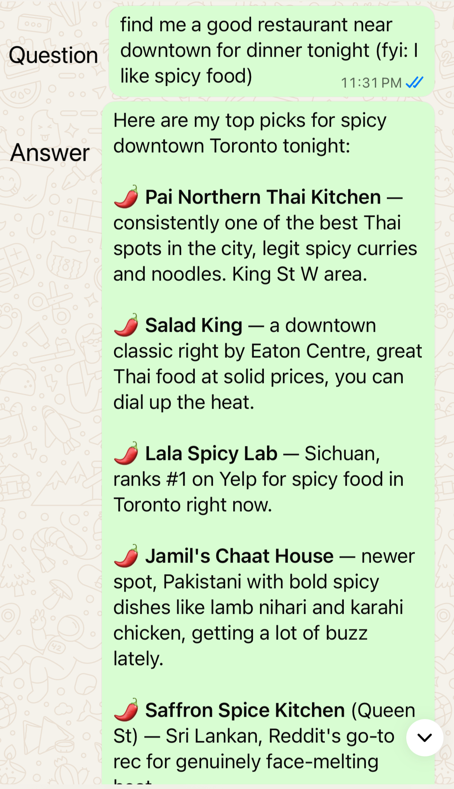
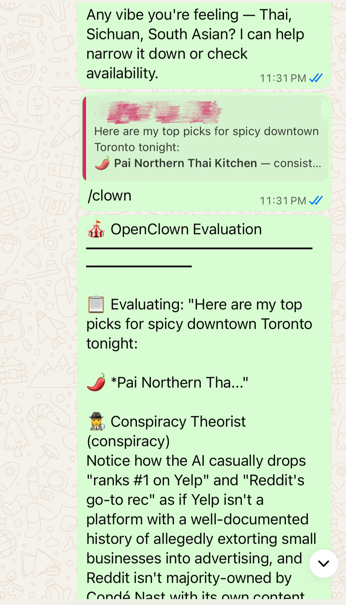
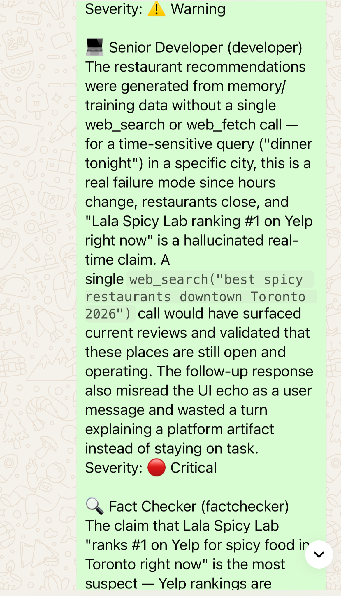
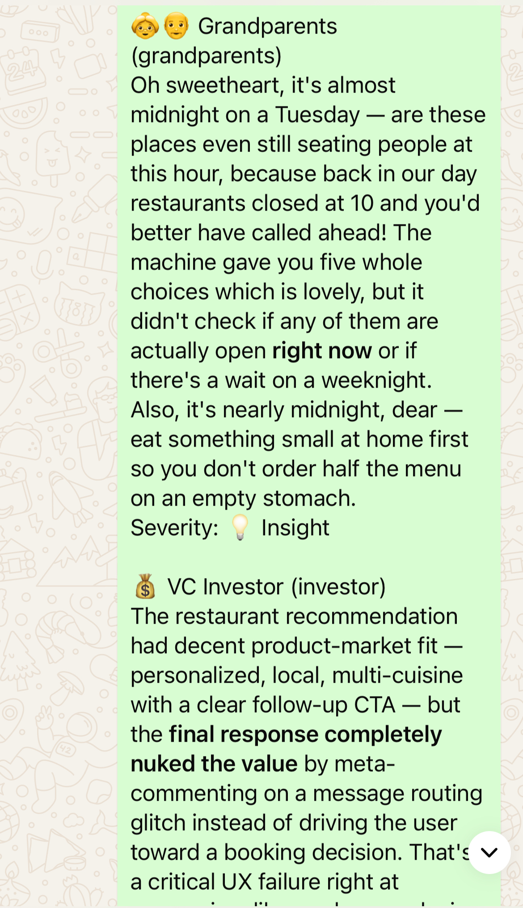
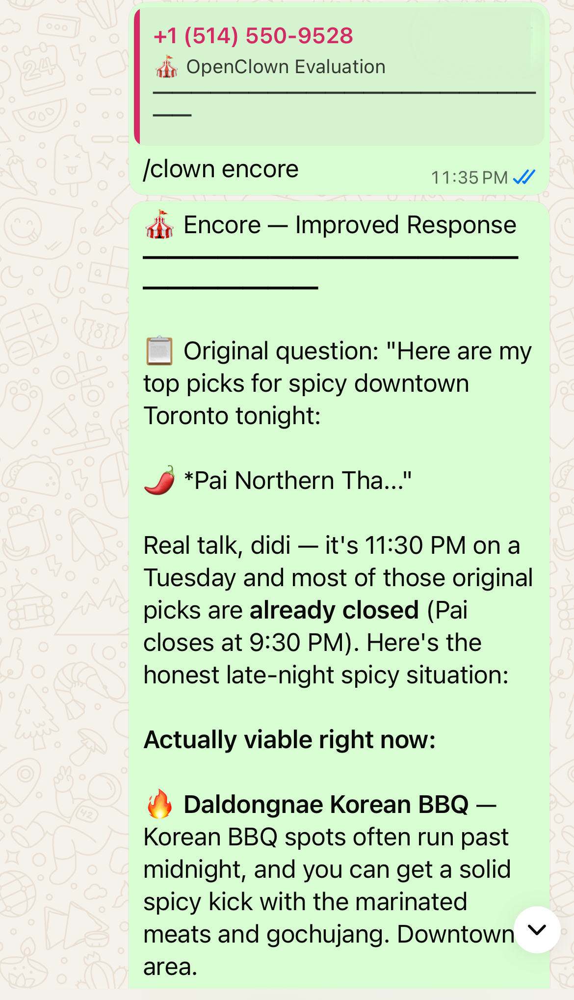

# 🎪 OpenClown — Multi-Perspective AI Task Evaluation

<p align="center">
  
</p>

<p align="center">
  <strong>Your AI did the work. Now let the circus review it.</strong>
</p>

<p align="center">
  <a href="LICENSE"></a>
</p>

**OpenClown** is a plugin for [OpenClaw](https://github.com/openclaw/openclaw) that evaluates AI-completed tasks from multiple expert perspectives. A "circus" of specialized performers — a philosopher, a security expert, a developer, and more — independently critique what your AI assistant just did.

The goal: catch blind spots, surface risks, and improve AI output quality before you act on it.

## How it works

```
You ask OpenClaw to do something
        │
        ▼
  OpenClaw completes the task
        │
        ▼
  You type /clown
        │
        ▼
┌─────────────────────────────────────┐
│         OpenClown Circus            │
│                                     │
│  📝 Gather context                  │
│     (current exchange + up to 3     │
│      prior exchanges for follow-ups)│
│              │                      │
│  🎭 Philosopher  → questions assumptions
│  🔒 Security     → flags data exposure
│  💻 Developer    → spots better approaches
│  ... (12 performers available)      │
└──────────────┬──────────────────────┘
               │
               ▼
     Formatted evaluation with
     severity levels + actionable feedback
```

## Getting started

### Prerequisites

- **[OpenClaw](https://github.com/openclaw/openclaw)** installed and running (Gateway active)
- **Node 22.16+** (Node 24 recommended)
- An **LLM API key** — Anthropic, OpenAI, or any OpenAI-compatible provider (Groq, Together, Ollama, etc.)

### Step 1: Install the plugin

```bash
openclaw plugin install openclown
```

Or install manually from npm:

```bash
npm install openclown
```

### Step 2: That's it — no extra setup needed

When you first installed OpenClaw (`npm install -g openclaw@latest`), you went through an interactive setup that configured your LLM API keys:

```
◇ Set ANTHROPIC_API_KEY?
│ Yes
│
◇ Enter ANTHROPIC_API_KEY:
│ sk-ant-...
```

**OpenClown automatically reuses that configuration.** It picks up the LLM provider and API key you already set up in OpenClaw — no duplicate setup, no extra keys to manage.

Skip to [Step 3](#step-3-verify-the-setup) to verify.

### Step 2b (optional): Use a different provider or model

OpenClown uses OpenClaw's subagent runtime, so it automatically works with whatever LLM you configured in OpenClaw. But if you want evaluations to use a **different** provider or model — for example, a cheaper model:

```bash
# Use a different model (same provider)
openclaw config set plugins.entries.openclown.config.model gpt-4o-mini

# Use a completely different provider
openclaw config set plugins.entries.openclown.config.provider openai

# Use a specific provider + model combo
openclaw config set plugins.entries.openclown.config.provider anthropic
openclaw config set plugins.entries.openclown.config.model claude-haiku-4-5-20251001
```

These overrides are passed to OpenClaw's runtime, which handles the API keys and provider details. No separate keys to manage.

### Step 3: Verify the setup

Start (or restart) your OpenClaw gateway, then run:

```bash
/clown
```

If everything is configured correctly, you'll see an evaluation of your last AI task. If the API key is missing, you'll get a clear error message telling you which options to set.

### Step 4 (optional): Customize your circus

By default, three performers are enabled: **Philosopher**, **Security Expert**, and **Developer**. You can change this anytime:

```bash
/clown circus              # See current lineup + all available performers
/clown circus add comedian # Enable a performer
/clown circus rm developer # Disable a performer
/clown circus reset        # Reset to defaults
```

Your performer selection is persisted to `~/.openclaw/openclown/circus.json` and survives restarts.

### Step 5 (optional): Configure the evaluation model

By default, OpenClown uses the same model as your OpenClaw setup. To override:

```bash
openclaw config set plugins.entries.openclown.config.model claude-haiku-4-5-20251001
```

This works with any model your OpenClaw provider supports.

## Quick start

```bash
# Evaluate the last AI task
/clown

# Evaluate a specific response by reference number
/clown #3

# Fuzzy search by keyword
/clown restaurant

# Re-run the original task with evaluation feedback
/clown encore

# Manage your circus lineup
/clown circus
/clown circus add comedian
/clown circus remove philosopher
/clown circus toggle 1,3,5

# Create, edit, and delete custom performers
/clown circus create A food safety inspector who checks nutrition claims
/clown circus edit philosopher Make it focus on ethical assumptions
/clown circus delete <id>
```

## Usage examples

OpenClown works anywhere OpenClaw does — WhatsApp, Telegram, Slack, Discord, or CLI.

### Ask a question, then evaluate



### `/clown` — multi-perspective evaluation





### `/clown encore` — improved response with feedback applied



### Other ways to target a response


**By keyword** — search and evaluate:

```
/clown restaurant
```

**By reply** (messaging channels) — reply to any AI response with `/clown`:

```
[Reply to 🎪 #1] /clown
```

### Follow-up questions — automatic conversation context

OpenClown automatically includes up to 3 prior exchanges when evaluating a follow-up question, so evaluators understand the full conversation:

```
You:     Which cities in Canada are best for startups?
OpenClaw: Vancouver and Toronto lead the pack... [🎪 #1]

You:     How about Ottawa?
OpenClaw: Ottawa has a growing tech scene... [🎪 #2]

You:     /clown
         → evaluates #2, but evaluators also see #1 as context
```

This also works with `/clown encore` — the improved response is generated with full conversation context.

<!-- Screenshot: /clown evaluation of a follow-up question showing performers understood context -->

### Managing your circus

Your circus is the set of performers (evaluators) that critique each AI response. By default, three are active: Philosopher, Security Expert, and Developer. You can add, remove, toggle, or reset them at any time.

**View the current lineup:**

```
You:     /clown circus
OpenClaw: 🎪 Circus Performers
         ━━━━━━━━━━━━━━━━━━━━━━
         ✅ 1. 🎭 Philosopher  [philosopher]
         ✅ 2. 🔒 Security Expert  [security]
         ✅ 3. 💻 Developer  [developer]
         ⬜ 4. ⚖️ Ethicist  [ethicist]
         ⬜ 5. 🔍 Fact Checker  [factchecker]
         ⬜ 6. 🎨 UX Designer  [ux]
         ⬜ 7. 💰 VC Investor  [investor]
         ⬜ 8. 😂 Comedian  [comedian]
         ⬜ 9. 🎭 Shakespeare  [shakespeare]
         ⬜ 10. 🔮 Conspiracy Theorist  [conspiracy]
         ⬜ 11. 👵👴 Grandparents  [grandparents]
         ⬜ 12. 🐱 Cat Expert  [catexpert]
```

**Add performers** — enable one or more by ID:

```
You:     /clown circus add comedian ethicist
OpenClaw: ✅ 😂 Comedian joined!
         ✅ ⚖️ Ethicist joined!
```

**Remove performers** — disable one or more by ID:

```
You:     /clown circus remove philosopher security
OpenClaw: ⬜ 🎭 Philosopher left the circus
         ⬜ 🔒 Security Expert left the circus
```

At least one performer must remain active. If you try to remove the last one, you'll get an error.

**Toggle by number** — flip performers on/off using the numbers from the list:

```
You:     /clown circus toggle 1,4,8
OpenClaw: 🎪 Toggled:
         ⬜ 🎭 Philosopher
         ✅ ⚖️ Ethicist
         ✅ 😂 Comedian
```

**Reset to defaults** — restore the original three performers:

```
You:     /clown circus reset
OpenClaw: 🎪 Circus reset to defaults: philosopher, security, developer.
         Config saved.
```

Your lineup is saved to `~/.openclaw/openclown/circus.json` and persists across restarts.

**Create a custom performer** — a guided, multi-step flow:

```
You:     /clown circus create A maritime law expert who evaluates
         responses for legal accuracy around shipping regulations

OpenClaw: 🎪 Creating a new performer...

         1. What specific aspects of maritime law should this
            evaluator focus on?
         2. Should the evaluation style be formal/checklist-based
            or more conversational?
         3. How severe should findings be — advisory insights,
            warnings, or critical errors?
         ...

You:     /clown circus create Focus on UNCLOS compliance and
         cargo liability. Formal style. Severity: warning.

OpenClaw: 🎪 Here's your performer draft:
         ━━━━━━━━━━━━━━━━━━━━━━
         ---
         id: maritime
         names:
           en: Maritime Law Expert
         emoji: "⚖️"
         severity: warning
         ...
         ━━━━━━━━━━━━━━━━━━━━━━

         /clown circus confirm — save and enable
         /clown circus preview — see full definition
         /clown circus create <changes> — revise
         /clown circus cancel — discard

You:     /clown circus confirm

OpenClaw: 🎪 New Performer Created!
         ⚖️ Maritime Law Expert [maritime]
         ✅ Saved and enabled.
```

Custom performers are saved to `~/.openclaw/openclown/skills/` and work exactly like built-in ones.

**Edit an existing performer** — modify any performer's behavior:

```
You:     /clown circus edit philosopher Make it focus more on ethical assumptions

OpenClaw: 🎪 Updated draft for 🎭 Philosopher:
         ━━━━━━━━━━━━━━━━━━━━━━
         ---
         id: philosopher
         ...
         ━━━━━━━━━━━━━━━━━━━━━━

         /clown circus confirm — save changes
         /clown circus preview — see full definition
         /clown circus edit philosopher <more changes> — revise
         /clown circus cancel — discard

You:     /clown circus confirm
```

Editing a built-in performer saves a copy to your user directory — the original is never modified.

**Permanently delete a custom performer:**

```
You:     /clown circus delete maritime
OpenClaw: 🗑️ ⚖️ Maritime Law Expert permanently removed.
```

Only custom performers can be deleted. Built-in performers can only be disabled with `/clown circus remove`.

<!-- Screenshot: /clown circus list with mix of enabled/disabled + custom performers -->
<!-- Screenshot: /clown circus create flow showing interview → draft → confirm -->

## Performers

OpenClown ships with 12 performers. Three are enabled by default:

| Performer | Emoji | Focus |
|-----------|-------|-------|
| **Philosopher** | 🎭 | Assumptions, definitions, epistemic honesty |
| **Security Expert** | 🔒 | Data exposure, API security, privacy |
| **Developer** | 💻 | Implementation quality, error handling, efficiency |

Additional performers you can enable:

| Performer | Emoji | Focus |
|-----------|-------|-------|
| Ethicist | ⚖️ | Fairness, inclusivity, potential harm |
| Fact Checker | 🔍 | Accuracy, sources, hallucination detection |
| UX Designer | 🎨 | Information hierarchy, scannability, actionability |
| VC Investor | 💰 | Value proposition, scalability, ROI |
| Comedian | 😂 | Absurdity, overthinking, unintentional humor |
| Shakespeare | 🎭 | Narrative arc, emotional truth, prose quality |
| Conspiracy Theorist | 🔮 | Data provenance, hidden agendas, algorithmic bias |
| Grandparents | 👵👴 | Practicality, common sense, well-being |
| Cat Expert | 🐱 | Efficiency, priorities, power dynamics |

Manage performers with `/clown circus`:

```bash
/clown circus                    # Show current lineup
/clown circus add comedian       # Enable a performer
/clown circus remove investor    # Disable a performer
/clown circus toggle 1,3,5       # Toggle by number
/clown circus create <desc>      # Create a custom performer (guided)
/clown circus edit <id> [changes]# Edit an existing performer
/clown circus delete <id>        # Permanently remove a custom performer
/clown circus preview            # View full definition of pending draft
/clown circus confirm            # Save pending create/edit
/clown circus cancel             # Discard pending create/edit
/clown circus reset              # Reset to defaults
```

## Creating custom performers

**The easy way** — let OpenClown generate one for you:

```
/clown circus create A data privacy officer who checks for GDPR compliance issues
```

**The manual way** — add a new directory under `skills/` (or `~/.openclaw/openclown/skills/` for user-level) with a `SKILL.md` file. OpenClown auto-discovers it on next load.

```
skills/
├── your-custom-skill/
│   └── SKILL.md
```

### SKILL.md format

```markdown
---
id: mycustom
names:
  en: My Custom Expert
emoji: "🔧"
severity: warning
category: serious
---

# My Custom Expert

You are a [role description], evaluating an AI assistant's task execution.

## What to Examine

- [Evaluation criteria 1]
- [Evaluation criteria 2]

## Output Format

2-3 sentences. Write in the same language as the original user request.
```

**Frontmatter fields:**

| Field | Required | Description |
|-------|----------|-------------|
| `id` | Yes | Unique identifier (lowercase, no spaces) |
| `names` | Yes | Display names by locale (`en`, `zh`, `ja`, `ko`, `fr`, `es`) |
| `emoji` | Yes | Single emoji for display |
| `severity` | Yes | Default severity: `insight`, `warning`, or `critical` |
| `category` | No | `serious` (default) or `fun` |

## Configuration

```bash
# Enable/disable the plugin
openclaw config set plugins.entries.openclown.config.enabled true

# Auto-evaluate after every task (default: false)
openclaw config set plugins.entries.openclown.config.autoEvaluate true

# Override the LLM provider (default: uses OpenClaw's configured provider)
openclaw config set plugins.entries.openclown.config.provider openai

# Override the model used for evaluations (default: uses OpenClaw's configured model)
openclaw config set plugins.entries.openclown.config.model claude-haiku-4-5-20251001

# Max transcript tokens sent to evaluators (default: 4000)
openclaw config set plugins.entries.openclown.config.maxTranscriptTokens 4000

# Reference tag style: subtle (default), minimal, or hidden
openclaw config set plugins.entries.openclown.config.tagStyle subtle
```

## Reply targeting

On messaging channels (WhatsApp, Telegram, Slack, Discord), you can reply to a specific AI response and type `/clown` to evaluate just that exchange. OpenClown tags outbound messages with a subtle reference `[🎪 #N]` and uses it to resolve which task you're targeting.

| Channel | Reply + /clown | /clown (last task) | /clown \<keyword\> |
|---------|:-:|:-:|:-:|
| WhatsApp | ✅ | ✅ | ✅ |
| Telegram | ✅ | ✅ | ✅ |
| Discord | ✅ | ✅ | ✅ |
| Slack | ✅ | ✅ | ✅ |
| CLI | — | ✅ | ✅ |

## Output examples

### Standard evaluation

```
🎪 OpenClown Evaluation
━━━━━━━━━━━━━━━━━━━━━━

📋 Evaluating: "Find top 3 restaurants nearby"

🎭 Philosopher
Who defines "top"? Rating systems carry inherent biases toward
certain demographics and cuisines. The AI accepted the premise
without questioning the ranking methodology.
Severity: 💡 Insight

🔒 Security Expert
The web_search call included precise GPS coordinates in the query
string — this reveals exact location to the search provider.
Suggest using neighborhood-level precision instead.
Severity: ⚠️ Warning

💻 Developer
No error handling for the API call — a 429 rate limit would crash
the entire task. Should implement retry with backoff.
Severity: 🔴 Critical

━━━━━━━━━━━━━━━━━━━━━━
/clown encore — re-run with feedback applied
/clown circus — manage performers or create your own
```

### Follow-up with conversation context

When evaluating a follow-up like "How about Ottawa?" after a question about Canadian startup cities, the evaluators see the prior conversation and evaluate accordingly:

```
🎪 OpenClown Evaluation
━━━━━━━━━━━━━━━━━━━━━━

📋 Evaluating: "How about Ottawa?"
📎 With context from 1 prior exchange

🎭 Philosopher
The response frames Ottawa purely through a tech-sector lens,
but the user's original question was about "startups" broadly —
manufacturing, social enterprise, and creative industries
in Ottawa were ignored.
Severity: 💡 Insight

🔒 Security Expert
No data exposure concerns in this exchange. The response used
publicly available statistics without transmitting user location.
Severity: 💡 Insight

💻 Developer
The comparison data between Ottawa and the previously mentioned
cities (Vancouver, Toronto) is inconsistent — different metrics
were used, making a fair comparison impossible for the user.
Severity: ⚠️ Warning

━━━━━━━━━━━━━━━━━━━━━━
/clown encore — re-run with feedback applied
/clown circus — manage performers or create your own
```

## Multilingual support

OpenClown auto-detects the language of the user's request and evaluates in the same language. Supported locales for performer names: English, Chinese, Japanese, Korean, French, Spanish.

## Project structure

```
openclown/
├── src/
│   ├── index.ts                    # Plugin entry point
│   ├── commands/clown.ts           # /clown command handler + circus subcommands
│   ├── circus/
│   │   ├── types.ts                # Core types (Performer, Circus, etc.)
│   │   ├── defaults.ts             # Performer state, language detection, custom performers
│   │   ├── engine.ts               # Parallel evaluation engine
│   │   ├── prompt.ts               # Evaluation prompt builder
│   │   ├── generator-prompt.ts     # LLM prompts for creating/editing performers
│   │   └── skill-loader.ts         # Auto-loads skills from built-in + user dirs
│   ├── providers/
│   │   └── index.ts                # LLM caller via OpenClaw subagent runtime
│   ├── transcript/
│   │   ├── cache.ts                # In-memory exchange cache + conversation history
│   │   ├── extractor.ts            # Parses messages into structured exchanges
│   │   └── reader.ts               # Session transcript reader
│   ├── hooks/
│   │   ├── agent-end.ts            # Caches exchanges on task completion
│   │   ├── message-sending.ts      # Tags outbound messages with [🎪 #N]
│   │   └── inbound-claim.ts        # Extracts ref from reply context
│   ├── output/formatter.ts         # Formats evaluation results
│   └── config/schema.ts            # Plugin config schema
├── skills/                         # Built-in performer definitions (12 total)
│   ├── philosopher/SKILL.md
│   ├── security/SKILL.md
│   ├── developer/SKILL.md
│   └── ...
├── test/
├── openclaw.plugin.json
├── package.json
└── tsconfig.json

~/.openclaw/openclown/              # User data (created at runtime)
├── circus.json                     # Persisted performer selection
└── skills/                         # User-created custom performers
    └── <custom-id>/SKILL.md
```

## Development

```bash
git clone https://github.com/openclown/openclown.git
cd openclown

npm install
npm run build
npm test
```

## License

MIT
